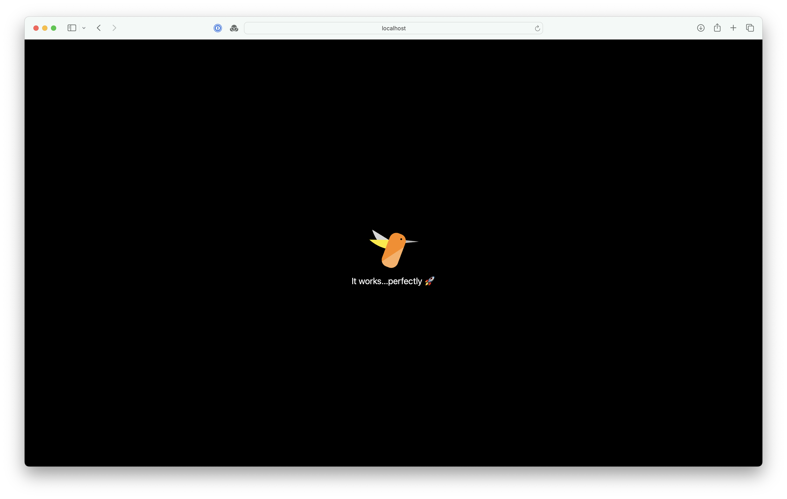

# Hummingbird 2 with Mustache and TailwindCSS
## Styling your Hummingbird application easily

The code uses [SwiftyTailwind](https://github.com/tuist/SwiftyTailwind).

Vapor 4 with Leaf and TailwindCSS tutorial can be found [here](https://medium.com/@kicsipixel/vapor-4-with-tailwind-css-6df8591c3e50)

